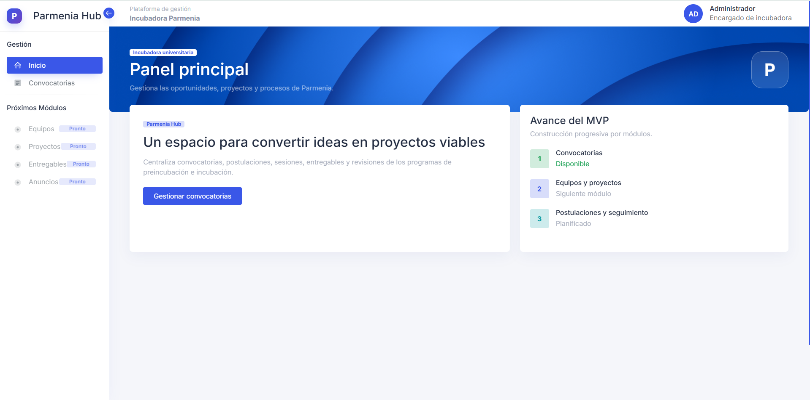
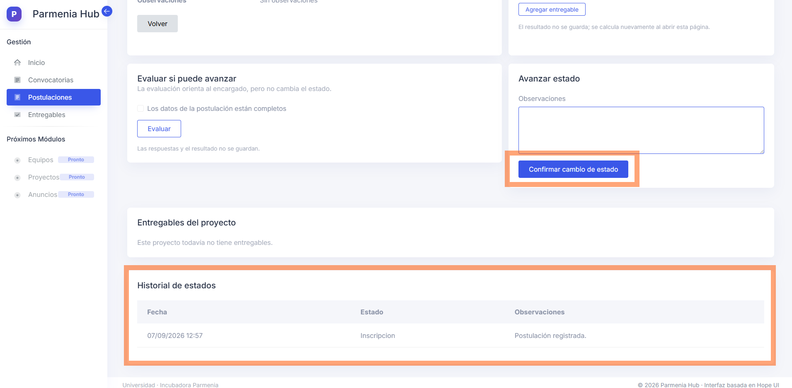
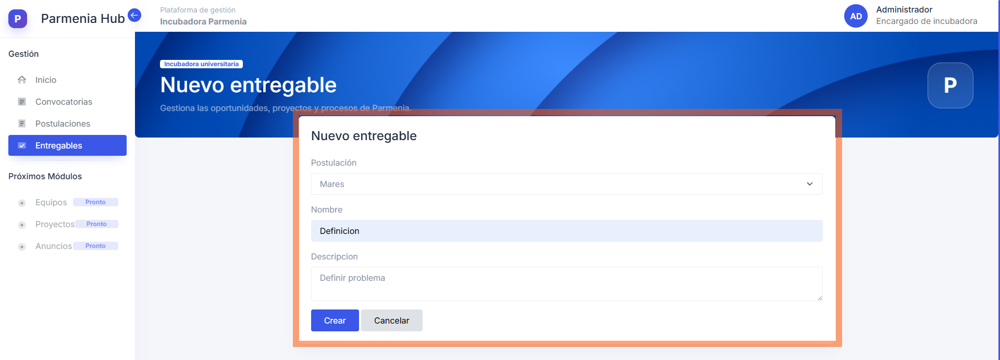
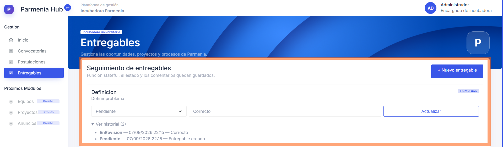
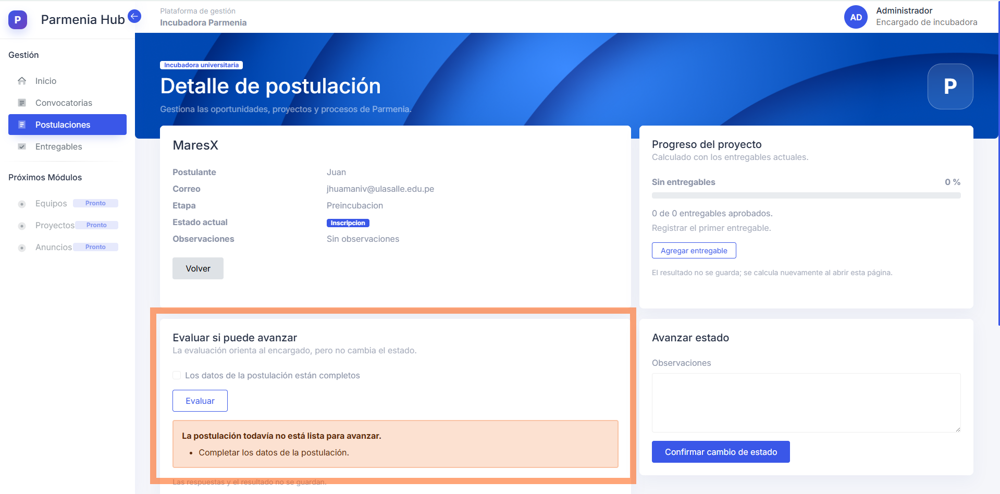
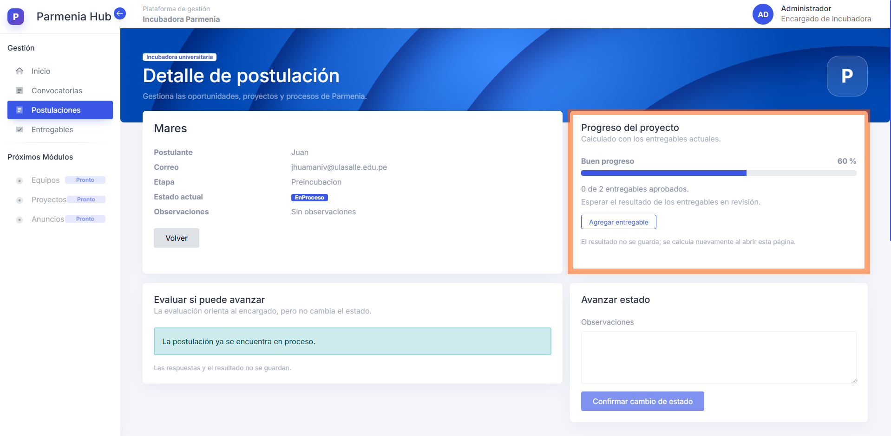

# ParmeniaHub

ParmeniaHub es una plataforma web pensada para la incubadora de proyectos Parmenia de la universidad.



La plataforma busca reunir en un solo lugar la información y las actividades de los alumnos que participan en los programas de preincubación e incubación.

El sistema permitirá, de forma progresiva:

- Registrar alumnos, equipos, ideas y proyectos.
- Publicar y consultar convocatorias.
- Dar seguimiento a una inscripción y a la primera sesión.
- Organizar entregables y revisiones.
- Publicar anuncios de la incubadora.
- Consultar proyectos de generaciones anteriores.
- Facilitar la comunicación entre alumnos y el encargado.
- Tener un chat grupal para cada proyecto.

Actualmente, el proyecto permite gestionar convocatorias, postulaciones y entregables.

## Funciones stateful y stateless

Esta tarea agrega dos funciones **stateful** y dos funciones **stateless**.

Una función **stateful** guarda información para recordar lo que ocurrió anteriormente. Una función **stateless** analiza la información que recibe y muestra un resultado, pero no guarda ese resultado.

### Funciones stateful

#### 1. Seguimiento de postulaciones

Permite registrar una postulación y avanzar por los siguientes estados:

`Inscripción → Primera sesión → Aceptada → En proceso`

Cada cambio guarda:

- El nuevo estado.
- La fecha del cambio.
- Las observaciones del encargado.
- El historial completo de la postulación.



Es stateful porque la aplicación debe recordar el estado actual y todos los cambios anteriores.

#### 2. Seguimiento de entregables

Permite crear entregables para una postulación y cambiar su estado:

`Pendiente → Enviado → En revisión → Requiere cambios o Aprobado`

Cada revisión guarda:

- El estado del entregable.
- Los comentarios del encargado.
- La fecha de la revisión.
- El historial de revisiones.




Es stateful porque los estados y comentarios permanecen guardados en PostgreSQL.

### Funciones stateless

#### 3. Evaluación para avanzar una postulación

Esta función ayuda al encargado a revisar si una postulación está lista para avanzar. Dependiendo de su estado, comprueba datos como:

- Que la información esté completa.
- Que el alumno haya asistido a la primera sesión.
- Que la idea sea viable.
- Que el encargado haya aprobado la continuación.



La función indica si la postulación puede avanzar y muestra lo que falta. No cambia el estado automáticamente ni guarda las respuestas de la evaluación.

Es stateless porque solamente analiza las respuestas y muestra un resultado temporal. El encargado sigue siendo quien confirma el cambio de estado.

#### 4. Progreso automático del proyecto

Esta función calcula el progreso usando los entregables reales de la postulación. Cada estado tiene un valor:

| Estado del entregable | Avance |
| --------------------- | -----: |
| Pendiente             |    0 % |
| Enviado               |   40 % |
| Requiere cambios      |   50 % |
| En revisión           |   60 % |
| Aprobado              |  100 % |

La aplicación muestra:

- El porcentaje general.
- El nivel de progreso.
- La cantidad de entregables aprobados.
- La siguiente acción recomendada.



Es stateless porque el porcentaje no se guarda. Se vuelve a calcular cada vez que se abre el detalle de la postulación.

### Relación entre las funciones

Las funciones stateful guardan los estados y los historiales. Las funciones stateless utilizan esa información para orientar al encargado y mostrar el progreso, sin crear datos adicionales.

```text
Postulación y entregables guardados
                ↓
Evaluación y cálculo temporal
                ↓
El encargado toma una decisión
                ↓
El cambio confirmado se guarda
```

## Arquitectura de n capas

El proyecto está organizado en capas. Cada capa tiene una responsabilidad concreta. Esta separación ayuda a mantener el código ordenado y permite hacer cambios sin afectar todo el sistema.

### 1. Capa de interfaz

Es la parte que ve y utiliza el usuario en el navegador.

Muestra las páginas, recibe la información de los formularios y presenta los resultados. En este proyecto se encuentra en `ParmeniaHub.Web`.

Por ejemplo, esta capa muestra la lista de convocatorias y el formulario para registrar una nueva.

### 2. Capa de lógica de negocio

Contiene las acciones que puede realizar el sistema y coordina el trabajo entre las demás capas.

Recibe una solicitud desde la interfaz, aplica el proceso necesario y pide guardar o consultar información. En este proyecto se encuentra principalmente en `ParmeniaHub.Application`.

Por ejemplo, esta capa se encarga de crear, listar, consultar y publicar convocatorias.

### 3. Capa de acceso a datos

Se encarga de la comunicación con la base de datos.

Guarda, busca y actualiza la información solicitada por la lógica de negocio. En este proyecto se encuentra en `ParmeniaHub.Infrastructure`.

La interfaz no accede directamente a la base de datos. Primero pasa por la lógica de negocio y esta utiliza la capa de acceso a datos.

### 4. Base de datos

Es donde se guarda la información de forma permanente.

ParmeniaHub utiliza PostgreSQL. La base de datos puede ejecutarse fácilmente con Docker.

## Flujo sencillo de una solicitud

Cuando una persona registra una convocatoria, ocurre lo siguiente:

1. La interfaz recibe los datos del formulario.
2. La lógica de negocio revisa y procesa esos datos.
3. La capa de acceso a datos prepara el registro.
4. PostgreSQL guarda la convocatoria.
5. El resultado regresa a la interfaz y se muestra al usuario.

En forma resumida:

`Interfaz → Lógica de negocio → Acceso a datos → Base de datos`

## Organización de la solución

```text
ParmeniaHub
├── src
│   ├── ParmeniaHub.Web             Interfaz web
│   ├── ParmeniaHub.Application     Lógica de negocio
│   ├── ParmeniaHub.Domain          Reglas y elementos principales
│   └── ParmeniaHub.Infrastructure  Acceso a datos
├── tests                            Pruebas del proyecto
├── compose.yaml                     Base de datos con Docker
└── ParmeniaHub.slnx                 Solución de .NET
```

`ParmeniaHub.Domain` contiene los elementos principales del sistema y sus reglas básicas. Por ejemplo, contiene lo que representa una convocatoria y los estados que puede tener.

## Tecnologías utilizadas

- ASP.NET Core MVC y C#.
- Entity Framework Core.
- PostgreSQL.
- Docker Compose.
- Bootstrap y Hope UI para la apariencia.
- xUnit para las pruebas.

## Ejecutar el proyecto

Primero crea el archivo `.env` a partir de `.env.example`. Después inicia la base de datos:

```powershell
docker compose up -d database
```

Luego ejecuta la aplicación:

```powershell
dotnet run --project .\src\ParmeniaHub.Web\ParmeniaHub.Web.csproj
```

Para ejecutar las pruebas:

```powershell
dotnet test .\ParmeniaHub.slnx
```
